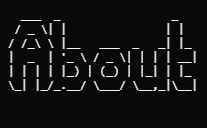
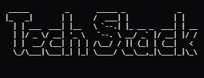

  <!---->
  
  
    
  
  
  
   
  <!--
   -->
  

 

---

I'm a software engineer and Computer Science graduate who enjoys taking things apart to figure out how they work (with the intention of putting them back together, _sometimes_). My background is in **game programming**, but I'm interested in much more than games. I like building systems, tools, prototypes, and experiments, especially when they involve learning something new or getting closer to the _underlying technology_.

Outside of larger projects, I spend a lot of time making small experiments, prototypes, tools, and games. I've participated in every Global Game Jam since 2022, and I tend to treat game jams as an excuse to learn something new, work together with my friends, and see how far I can take it before the deadline wins (it always does). That same philosophy works into all the other little projects I make, starting with some variation of _"I wonder if I can..."_ or _"I wonder how this works..."_ and tend to end with a repository.

These days, I'm particularly interested in systems programming, developer tools, game technology, AI, and low-level software. If it involves learning how something works and then building it myself, chances are I'll find it interesting.

---

---

  

---

---

## Latest Project - R36S Input Driver

A low-level software project focused on interfacing with the R36S handheld's physical input hardware and exposing its controls to software running on the device.
The project has been an opportunity to explore software development beyond the usual application layer, including:

- Linux input systems
- Hardware / device interfaces
- C / C++
- Low-level debugging
- Cross-compilation
- ARM-based systems
- Working within the constraints of a small embedded device

Rather than treating the R36S simply as a game console, this project explores it as a small Linux computer: understanding how its hardware, operating system and applications interact and building the missing pieces where necessary.

## Featured Projects

### 🏗️ [LaMancha Engine](https://github.com/ph0nsy/LaMancha-Engine)

A lightweight **2D game engine** designed with low-spec hardware in mind, including devices such as the R36S.
Built around experimentation with:

* **C++**
* **Lua scripting**
* **OpenGL / OpenGL ES**
* **Entity Component Systems**
* Cross-platform development
* Low-end hardware constraints

This is one of my main explorations into what happens when you move below the usual game-engine abstractions and start building the technology yourself.

---

### 🎮 Lady Umbrella

My Master's project at U-Tad. I worked on the game from a programming perspective, with a particular focus on:

* **Gameplay programming**
* **Camera systems**
* **UI**
* **Menu systems**
* **Navigation**

---

### 🕹️ Game Jammer

I've participated in **every Global Game Jam since 2022** and other game jams in between. Using game jams as an excuse to experiment with mechanics, technologies and ideas that I wouldn't necessarily explore in a larger project.

| Year     | Jam               | Game                                                                                                                                           | Code                                                               |
|----------|-------------------|------------------------------------------------------------------------------------------------------------------------------------------------|--------------------------------------------------------------------|
| **2022** | Global Game Jam   | [Vice Duo](https://v3.globalgamejam.org/2022/games/vice-duo-4)                                                                                 | [Repository](https://github.com/ph0nsy/GGJ-22)                     |
| **2023** | Global Game Jam   | [Sprouts](https://v3.globalgamejam.org/2023/games/sprouts-7)                                                                                   | [Repository](https://github.com/ph0nsy/GGJ-2023)                   |
| **2024** | Mini Game Jam #26 | [Uncivic Driver Rhythm](https://ph0nsy.itch.io/uncivic-driver-rhythm)                                                                          | [Repository](https://github.com/ph0nsy/Uncivic_Driver_Rhythm)      |
| **2024** | Global Game Jam   | [Redemption](https://globalgamejam.org/games/2024/redemption-4)                                                                                | [Repository](https://github.com/ph0nsy/GGJ24)                      |
| **2025** | Global Game Jam   | [Bubble Paper Shooter](https://globalgamejam.org/games/2025/bubble-paper-shooter-fabrik-xtream-survival-and-what-hell-happening-real-popity-3) | [Repository](https://github.com/ph0nsy/GGJ_25)                     |
| **2026** | Global Game Jam   | Brains, Hearts & Courage                                                                                                                       | [Repository](https://github.com/ph0nsy/GGJ2026)                    |
| **2026** | NOKIA 3310 JAM 8  | [High Noon Slash](https://ph0nsy.itch.io/high-noon-slash)                                                                                      | [Repository](https://github.com/ph0nsy/NOKIA-3310-JAM-8/tree/main) |

---

### University Games, Proejects & Experiments

A selection of smaller projects, prototypes and experiments.

#### 📚 [Z80 Assembly Guide](https://ph0nsy.github.io/z80-Assembly-Guide/)

A guide to **Z80 Assembly**, documenting low-level programming concepts and experimentation with an older architecture.

#### 🤖 [AI Projects](https://github.com/ph0nsy/AI_Projects)

A collection of AI and data-mining projects for university.

#### 🧮 [Math-Rails Line Mapper](https://ph0nsy.itch.io/math-rails-line-mapper)

A small mathematical/game-development experiment exploring line mapping and rail-based movement.

#### 💿 [DVD Dodge](https://ph0nsy.itch.io/dvd-dodge)

A small arcade-style experiment built at the time I was at university work.

#### 🧪 [Shitpost Status](https://ph0nsy.itch.io/shitpost-status)

A university project that exists primarily because sometimes the best way to learn is to make something ridiculous.

#### 🗺️ [Misterious Places](https://ph0nsy.itch.io/misterious-places-game-concept)

An early game-development university project from 2019.

#### ☀️ [Sounds of the Solar System](https://ph0nsy.github.io/Sounds-of-the-Solar-System/)

An interactive experiment exploring the idea of turning data from the Solar System into sound.

#### 👁️ [POV:D](https://pov-d.vercel.app)

Small web-based project.

---

  <i>Build things. Break things. Figure out why they broke. Build them better.</i>

